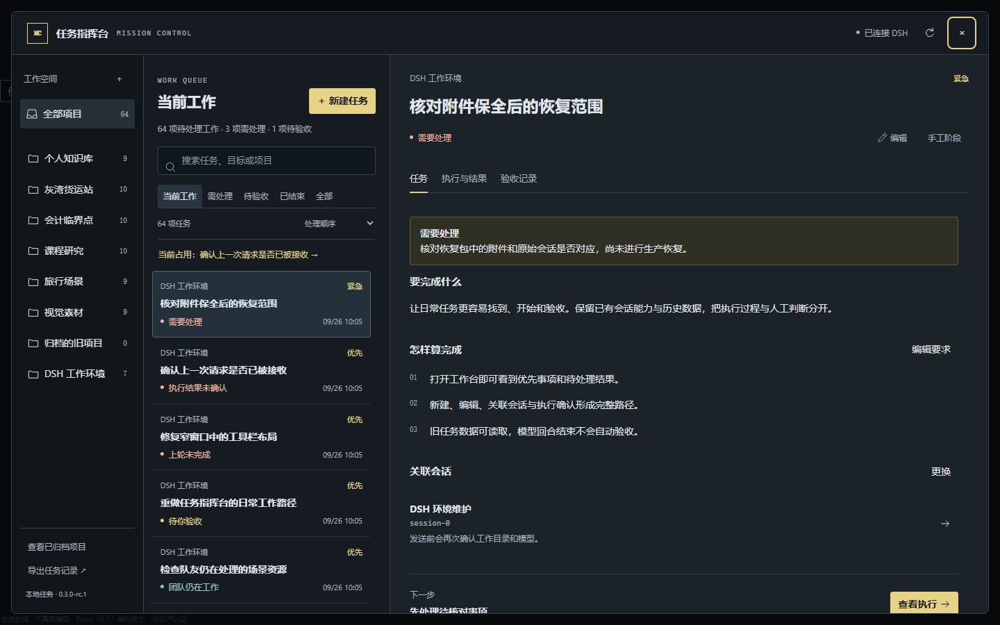

# DSH Mission Control · 任务指挥台

把要做的事、AI 的执行和你的验收放在一起，但不把它们混为一件事。

本分支候选版本 **0.3.0-rc.1**，集成目标 **DeepSeek Harness 0.1.7-rc.2**。起点为 `codex/desktop-plugins-017` 的 `30e3f9e4943b866974b2330167d9f910ab2dea86`，承接 `codex/mission-control-redesign` 上的 `ce8e1ad41cc8a9b524947a6c71d28166199dcd91` 数据保护检查点，不从旧 `main` 覆盖安装。



## 日常使用

从官方 DSH 窗口的侧栏或会话标题栏打开“任务指挥台”。左侧选择项目，中间查看工作队列，右侧处理任务；窄窗口切换列表和详情，不横向挤压三个栏目。

普通任务只需名称。目标、验收要求可以随后补充。名称、项目和优先级放在独立编辑窗口，浏览时不铺满表单。保存任务不会发送模型请求。任务可以搜索，按处理顺序或更新时间排列；需要处理的问题、未确认请求、模型已结束但待验收的结果会分开显示。界面提供“当前占用”的直达入口，包括窄窗口的执行详情。

任务详情分为三个区域：

- **任务**：目标、验收要求、关联会话；复杂任务可以展开计划、前置任务和证据要求。
- **执行与结果**：发送前确认工作目录、模型、会话和完整提示词；查看本轮模型输出、工具摘要及团队活动。
- **验收记录**：保存实际检查结果、计划确认与历史记录，明确进行人工验收。已关闭任务可明确重新打开，保留旧记录，不自动重发。

项目可以归档和重新启用，不删除其中的任务。仍在运行、等待核对的任务不会因项目归档而从当前工作中消失。导出的是项目和任务的 **JSON 记录**，不是官方会话备份或附件导出。

编辑冲突时保留输入，展示最新内容，需要再次明确确认后才能覆盖。保存回执不确定时先读取当前状态，不自动重试写入。弹窗可用键盘操作，放弃未保存输入前会提示；所有样式限定在插件自身范围内，不改变宿主页面的全局字体、滚动或配色。

## 执行的边界

执行使用官方 SessionController 和会话配置的模型、工具、工作目录及权限。预览不是发送；保存请求登记后才调用官方 prompt。同一发送意图不会再次派发。超时、关闭面板、断线和插件重启都不会触发自动重发。

“本轮已结束”只表示模型回合结束，不等于任务通过验收。人工验收必须填写核对结果并明确确认；它与执行派发共用服务端执行队列，避免检查空闲与保存之间穿插新的发送。仍有活动或未确认请求、排队消息或忙碌团队时拒绝提前验收。任务的前置条件、要求的证据及计划确认仍适用。

**停止主助手本轮**仅处理仍能确认属于本插件的排队消息或活动回合。不会按进程名终止程序，不承诺停止所有队友。Lead 结束时仍会观察 Teams 的成员与未投递消息；团队仍忙或不可读时不继续派发。解除占用是用户核对后的记录操作，不是取消、重发或验收。

关闭面板、卸载插件不终止官方会话；插件不写自定义官方会话事件或修改官方会话日志。普通浏览器不具备旧 DshDesktop 原生桥时，任务管理本身仍可使用。旧可选 Browser Bridge 保持原有合同，官方 Desktop 的认证通过 Host 的 Connection admission 接入，两者不是同一认证路径。

## 既有数据

仍使用以下两个文件，没有新增数据库，没有把演示任务写进初始状态：

```text
<DSH_HOME>/storages/dsh-mission-control/state-v1.json
<DSH_HOME>/storages/dsh-mission-control/execution-v1.json
```

当前 v1 项目、任务、会话绑定、计划、审批、证据和执行引用保留。新验收操作使用原有 `manual-acceptance` 证据、任务阶段和审计结构，两个 schema 版本均未变化。

有效的当前格式直接读取，不因加载而重写。损坏、格式异常或读取失败不会变成空状态覆盖原件。确实命中更早的 `taskRuns` 旧布局时，沿用既有迁移，并先独占创建 `.pre-migration-<uuid>.json` 原字节副本并回读核对；备份或迁移失败则不替换原件。这不等于整套 DSH 数据备份。

## 构建与安装检查

保留 React 18.3.1、TypeScript 6.0.3、DSH 0.1.7-rc.2 依赖约束。仅增加与宿主一致的 React DOM 18.3.1 开发依赖用于隔离预览，锁文件同步更新；没有增加生产依赖。项目级 `allowBuilds` 只批准锁定版本所需的依赖安装脚本。

在已有源码仓库的本任务分支中：

```sh
pnpm install --frozen-lockfile
pnpm run build
```

客户端仍构建为 `window.__ModuleLoader__.load({id:"dsh-mission-control", ...})`，不是另一个独立网页应用。`package.json` 保留官方客户端声明和 Host bundle，`cordis.patch.yml` 保留 Host 入口。生产包使用宿主 React，预览从锁定的开发依赖加载 React/React DOM，它们不进入 TGZ。

从已构建文件打包时，设置 `DSH_MC_LIB_DIR`、`DSH_MC_PACK_STAGE`、`DSH_MC_PACK_DEST` 三个绝对路径，再运行 `npm run pack:built`。stage 必须是新的隔离目录，脚本不清理或复用已有目录。协议开发语料仍留在仓库，运行时校验合同已编译进 `lib`，不再把开发语料作为 TGZ 安装依赖。

候选已在 Windows 隔离环境完成标准构建、完整测试和浏览器交互检查。生产安装通过官方 Desktop 的插件页面选择 TGZ；不手工覆盖 profile、复制 node_modules、运行旧恢复脚本或升级 DSH。安装前保留原有任务数据。实际 Desktop 与 2077 组合仍需安装后检查。

## 测试

先构建，再将 `DSH_MC_TEST_TMP` 设置为明确的隔离测试根目录，不能指向用户主目录或真实 DSH_HOME：

```sh
pnpm test
pnpm run test:browser
pnpm run test:workbench
```

`test:workbench` 打开真实 `lib/client.js` 组件，注入合成会话与 Host API；不调用模型。它检查 64 项任务、空状态、新建、冲突输入、会话绑定、发送确认、重复点击、未确认结果、Teams、人工验收、焦点、样式隔离，以及 1440/960/700/390 像素窗口。测试结果和截图输出到指定测试根下的新子目录。浏览器可用 `DSH_MC_BROWSER_EXECUTABLE` 指定现有 Chromium，否则使用 Playwright 自带浏览器。

`test:execution-browser` 是原有显式真实模型 Lab 入口，本次云端工作没有运行它。不要把它作为普通预览自动启动。

本轮实际验证与环境限制见 [VALIDATION.md](docs/VALIDATION.md)。旧版 CI badge 或以前的 66 项结果不代表本候选已经通过同一套环境验证。

MIT License.
